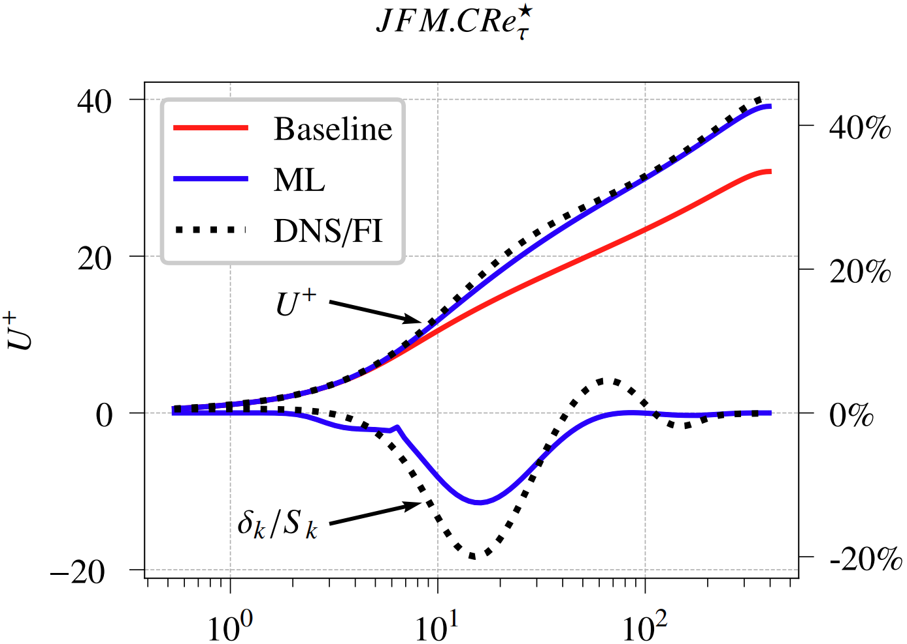

# ML-RANS-Turbulence-Modeling-Variable-Property-Flows

PyTorch source code linked to the publication:
* R. Diez Sanhueza, S.H.H.J. Smit, J.W.R. Peeters, R. Pecnik (2023). Machine learning for RANS turbulence modeling of variable property flows. Computers & Fluids, vol. 255, p. 105835. https://www.sciencedirect.com/science/article/pii/S0045793023000609

## Key features
* Organized repository, with a clear separation between the different software components:
  - CFD solver, field inversion, neural network training, injection of neural network corrections, etc.
* Written in modern PyTorch, with CUDA support.
* Results are stored as plain JSON files (zip-compressed) for improved transparency and compatibility.

## How to use
- For simplicity, the Python code is split into 5 (sequential) subfolders:

   a) `code/a_dns`: Import reference DNS data considered in the study (from `data/input`).
  
   b) `code/b_rans_solver`: CFD solver with various RANS turbulence models (Cess, MK, Spalart-Allmaras, SST, and V2F).
  
   c) `code/c_field_inversion`:  Field inversion optimizer for the MK turbulence model (hosted in `code/b_rans_solver`).
  
   d) `code/d_neural_network_mk_keq`:  Machine learning framework containing the neural network architecture, datasets, training procedure, and validation assessment.
  
   e) `code/e_injecting_corrections`: Advanced script to inject the neural network corrections back into the CFD solver, using the appropriate stabilization methodology.

- Please note that each subfolder depends on the previous components: $a \to b \to c \to d \to e$.
  - The folder `code/misc` only contains a few general-purpose functions for the rest of the code.
- The output of the Python code is stored in `data/output`.

